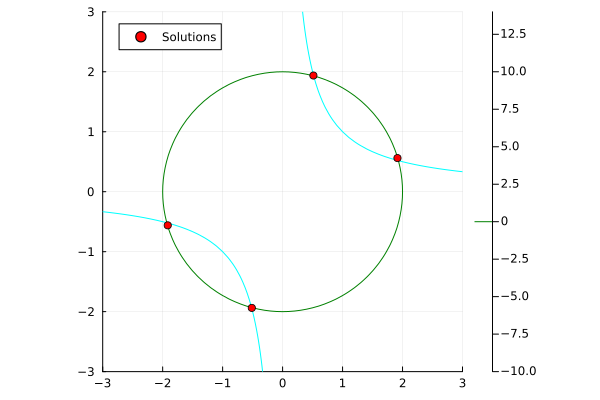

# Homotopy Continuation in Julia

This is a project for the "Laboratorio Computazionale" exam at the University of Pisa

## Implemented

- Total-degree Homotopy with "Roots of unity" start system
- Euler-Newton predictor-corrector method with adaptive step size
- Homotopy Continuation for all roots of the target system

## TODO

- Projective coordinates
- Parallelization
- Extract functions in separate modules(?)

## Example system

$$
\begin{align*}
x^2 + y^2 - 4 &= 0 \\
xy - 1 &= 0 \\
\end{align*}
$$

Plot of the approximate solutions:

