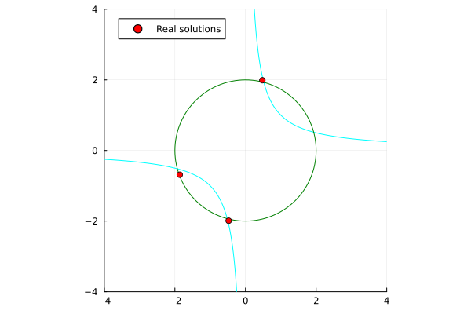
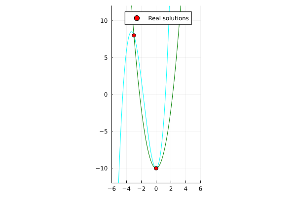
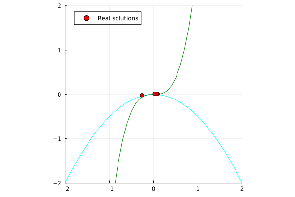
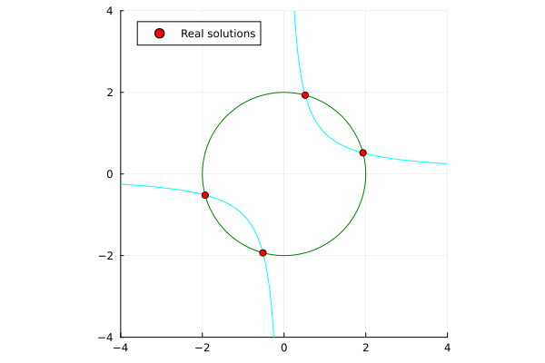

# Homotopy Continuation in Julia

This is a project for the "Laboratorio Computazionale" exam at the University of Pisa

## Implemented

- Total-degree Homotopy with "Roots of unity" start system
- Euler-Newton predictor-corrector method with adaptive step size
- Homotopy Continuation for all roots of the target system

## TODO

- Parallelization
- Homogenization

## Example systems

Here's some tests on 2x2 systems, with the plotted real approximate solutions

$$
\begin{align*}
x^3 + 5x^2 - y - 10 &= 0 \\
2x^2 - y - 10 &= 0 \\
\end{align*}
$$

| Single-threaded   | Multi-threaded (nproc=6)        |
|-------------------|---------------------------------|
|  |  |

---

$$
\begin{align*}
x^2 + 2y  &= 0 \\
y - 3x^3 &= 0 \\
\end{align*}
$$

| Single-threaded   | Multi-threaded (nproc=6)        |
|-------------------|---------------------------------|
|  |  |

$$
\begin{align*}
x^2 + y^2 - 4 &= 0 \\
xy - 1 &= 0 \\
\end{align*}
$$

| Single-threaded   | Multi-threaded (nproc=6)        |
|-------------------|---------------------------------|
|  |  |

---

$$
\begin{align*}
x^2 + y^2 - 2 &= 0 \\
xy - 1 &= 0 \\
\end{align*}
$$

| Single-threaded   | Multi-threaded (nproc=6)        |
|-------------------|---------------------------------|
|  |  |
